# Introduction

* Bitcoin https://bitcoin.org/en/bitcoin-paper
* S&P500 https://en.wikipedia.org/wiki/S%26P_500
* Gold https://www.investopedia.com/articles/economics/09/why-gold-matters.asp

The purpose of this report is to analyze Bitcoin as an asset compared to other more traditional assets such as stocks and gold. Recently there has been large interest in Bitcoin as an investable asset due to it's high returns in the last decade. We will attempt to give a full picture of the asset using the tools and techniques from traditional finance, then draw some insights and recommendations about whether or not to include it in the portfolio of any investment fund. 

# 📝 Exploratory Data Analysis
We will be using historical price data spanning from year September 2014 to November 2021.
Each of the data sets for **Bitcoin**, **SP500**, **Gold**, and **CPI** do not match perfectly in their date columns because of differences in their trading frequency. Bitcoin uniquely trades 365 days of the year, whereas SP500 trades only 252 days of the year. Gold and CPI are given in a monthly data format.

In this report, we will be using my own shorthand notation, which you will see occasionally through out the notebook.
 - BTC = Bitcoin
 - SPX = S&P 500 index
 - dr = daily returns
 - mr = monthly returns
 - ar = annual returns

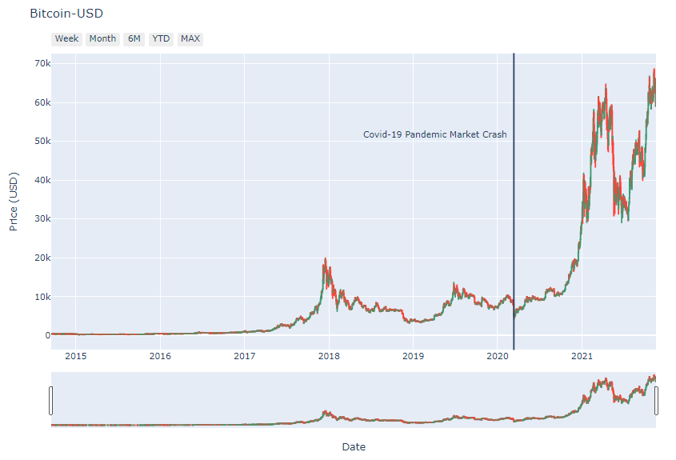
Historical Bitcoin prices.

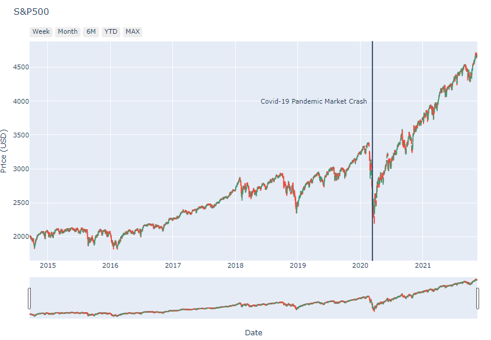
Historical SP500 price.

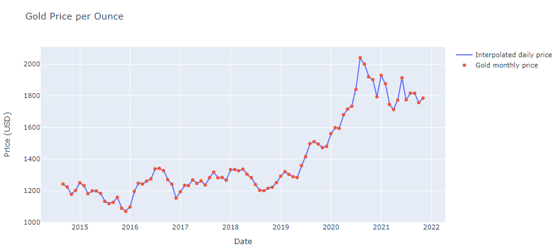
Historical Gold price.

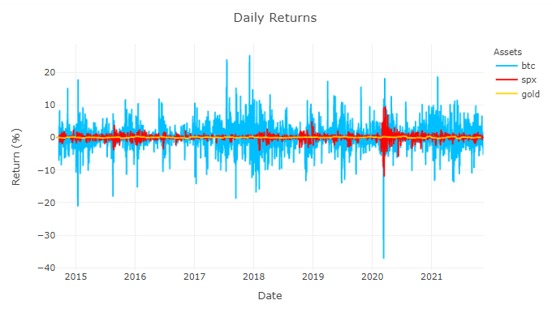
Daily returns time-series plot.

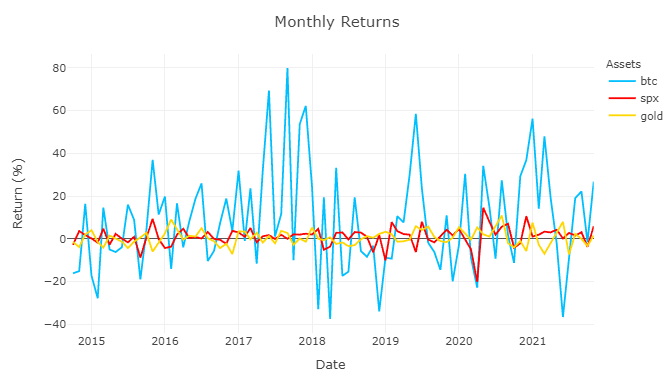
Monthly returns time-series plot.

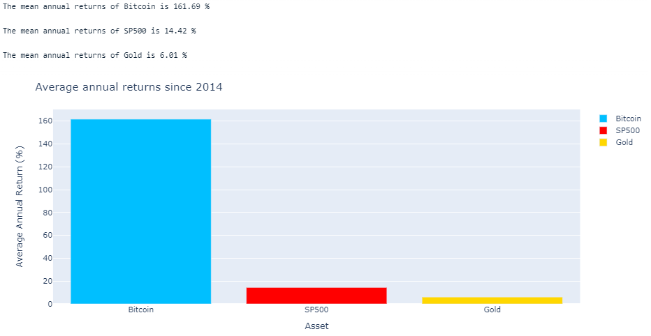
Comparison of average annual returns.

# 📅 CPI and Inflation

Consumer Price Index (CPI) is a measure of the general cost of living. It is calculated by the weighted average of the prices of certain consumer goods and services. Inflation rate is determined by the rate of change in CPI, which is considered to be the measure of the increase price of goods. More broadly, most investable assets appreciate in price due to inflation, therefore the inflation rate is considered a benchmark for all investment portfolios to surpass.

 Looking closely at the tail of the CPI and inflation data, we notice that there has been a inflection point near the start of the Covid-19 pandemic, where CPI rate change increases. 

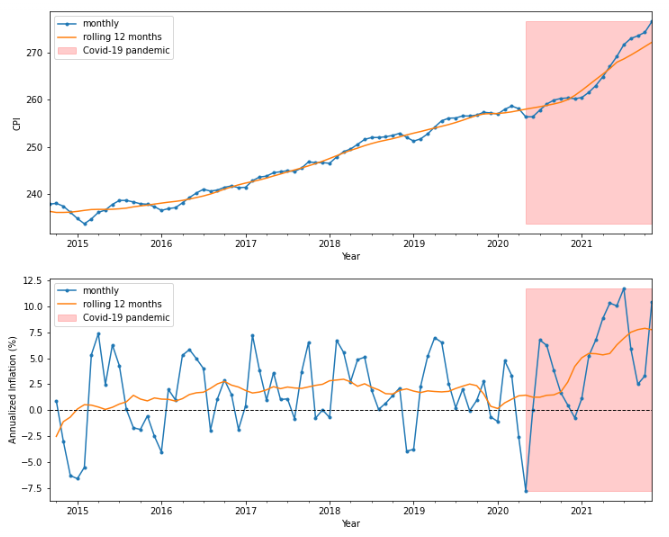
CPI and Inflation.

# 📊 Volatility analysis 

## Drawdown Analysis

Drawdown is a measure of the percentage decline of the price from it's recent peak. It is graphically shown in the plots below as the difference between the cumulative maximum (red line) and the daily price (blue line). Drawdowns analysis is used to show the potential downsides of an investment.

From the plots below, we can see the extreme differences between each asset. Gold is currently in it's largest drawdown, spanning from August 2020 and still have not recovered. S&P500 had it's largest drawdown recently during the start of the pandemic market crash in March 2020, dropping to about -30%. Though it promptly recovered by August 2020 spanning about 5 months. Bitcoin's largest drawdown is a drop fo -83% and took about 3 years to recover. It is quite astounding to see that since 2014, Bitcoin has already multiple drawdown's that are bigger and longer period than S&P500's largest drawdown.

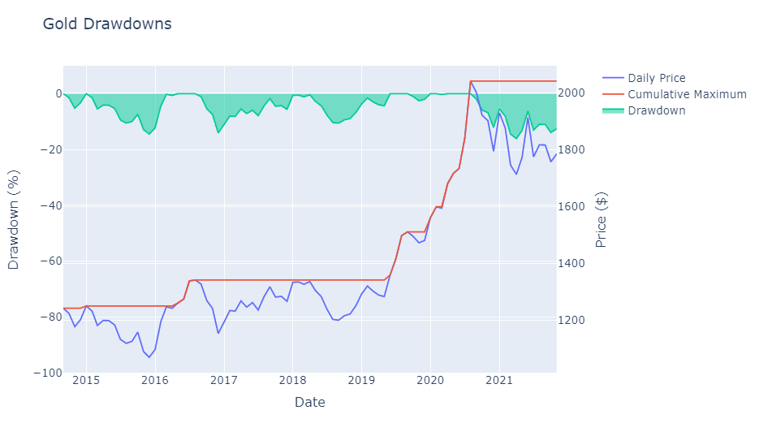
Gold drawdowns.

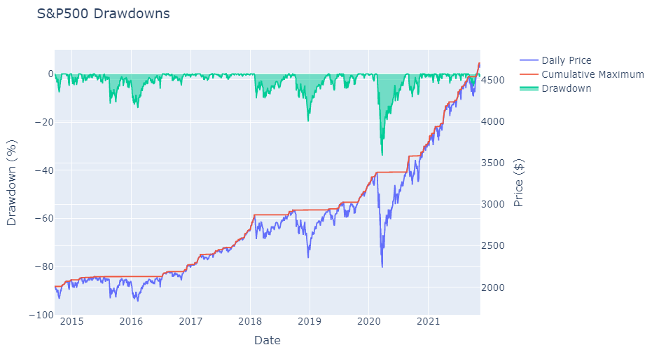
S&P500 drawdowns.

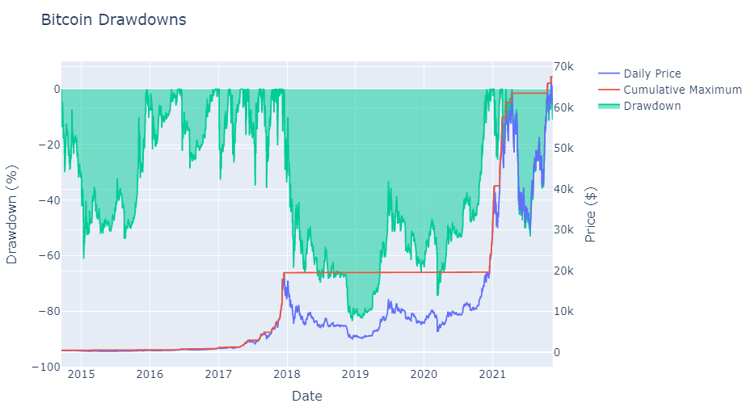
Bitcoin drawdowns.

## Distribution of Daily and Monthly Returns

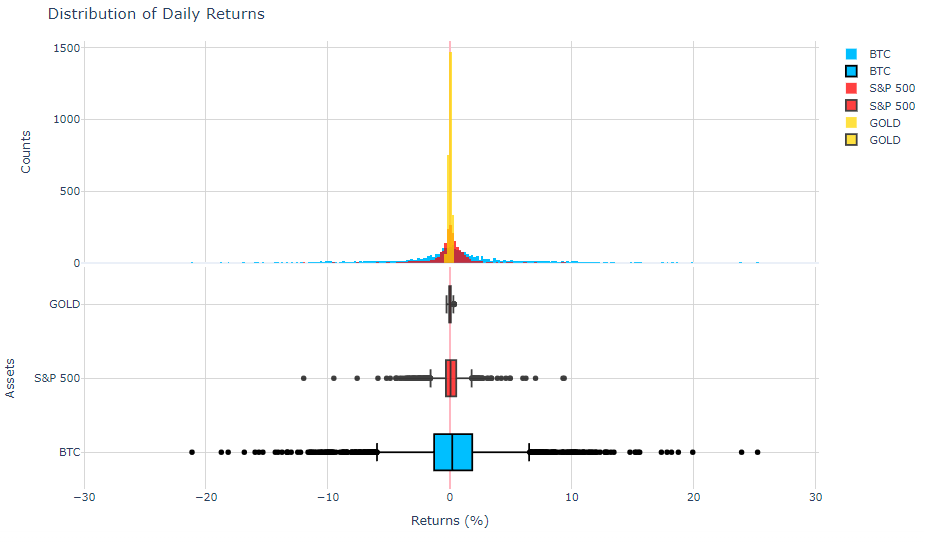

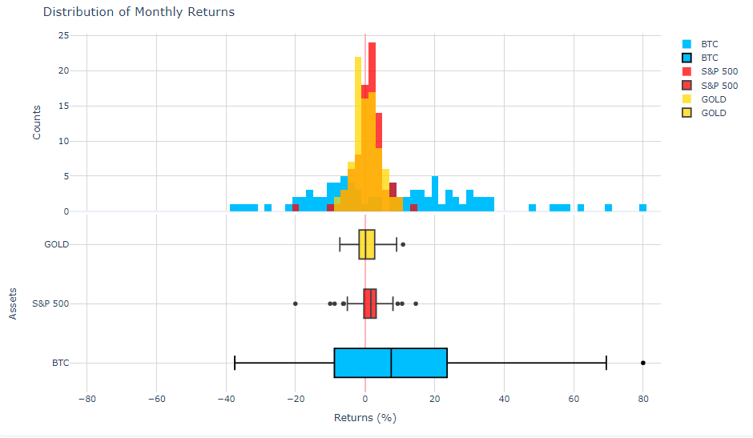

